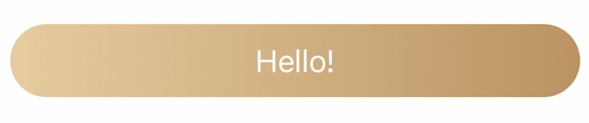

# Egret

[](https://travis-ci.org/Thisismy0312/Egret)
[](https://cocoapods.org/pods/Egret)
[](https://cocoapods.org/pods/Egret)
[](https://cocoapods.org/pods/Egret)

## Example

To run the example project, clone the repo, and run `pod install` from the Example directory first.

## Requirements

## Installation

Egret is available through [CocoaPods](https://cocoapods.org). To install
it, simply add the following line to your Podfile:

```ruby
pod 'Egret'
```

## Useage

```swift
import Egret
```

### Example

#### EgretButton

```swift
let button = EgretButton()

button.colorHead = UIColor(hex: 0xEDCC99)             // Heade color of EgretButton
button.colorTail = UIColor(hex: 0xC4925A)             // Tail color of EgretButton
button.title = "Hello!"                               // Title of EgretButton
button.titleColor = .white                            // The color of button title
button.backAction = { self.button.isEnabled = false } // Click action of EgretButton
button.startPoint = CGPoint(x: 0, y: 1)               // Start position of gradient layer
button.endPoint = CGPoint(x: 1, y: 1)                 // End position of gradient layer
button.radius = 20                                    // Corner radius of EgretButton
```

**EgretButton attributes**

| attributes | type |
|:------------:|:------:|
|`colorHead`| UIColor|
|`colorTail`|UIColor|
|`titleColor`|UIColor|
|`title`|String?|
|`font`|UIFont|
|`startPoint`|CGPoint|
|`endPoint`|CGPoint|
|`backAction`|(() -> Void)?|
|`radius`|CGFloat|
|`isEnabled`|Bool|
|`icon`|UIImage?|




#### EgretInputView

```swift
let phoneInput = EgretInputView()
let codeInput = EgretInputView()

phoneInput.title = "Mobile"             // Title of EgretInputView
phoneInput.haveCodeSelect = true        // Need country code selector
phoneInput.keyboardType = .numberPad    // Keyboard type of EgretInputView

codeInput.title = "Code"
codeInput.haveSubmit = true             // Show submit
codeInput.sendTitle = "Send"            // Title of submit
codeInput.keyboardType = .numberPad
codeInput.counter = 120                 // Countdown time
codeInput.submitActoin = yourFunction() // Action of Submit
```

**EgretInputView attributes**

|attributes|type|
|:---:|:---:|
|`haveCodeSelect`|Bool|
|`haveSubmit`|bool|
|`sendTitle`|String|
|`enabled`|Bool|
|`title`|String?|
|`keyboardType`|UIKeyboardType|
|`counter`|Int|
|`submitActoin`|(() -> Void)?|
|`text`|String?|
|`code`|String?|


## Contributors ✨

<table>
  <tr>
    <td align="center"><a href="http://ruilisi.co/"><br /><sub><b>Miles</b></sub></a><br /><a href="https://github.com/ruilisi/Egret/commits?author=Thisismy0312" title="Code">💻</a> <a href="https://github.com/ruilisi/Egret/commits?author=Thisismy0312" title="Documentation">📖</a></td>
  </tr>
</table>

## License

Egret is available under the MIT license. See the LICENSE file for more info.
